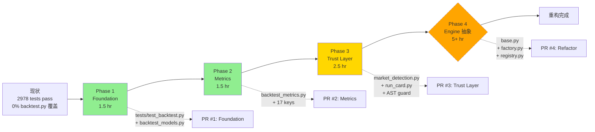
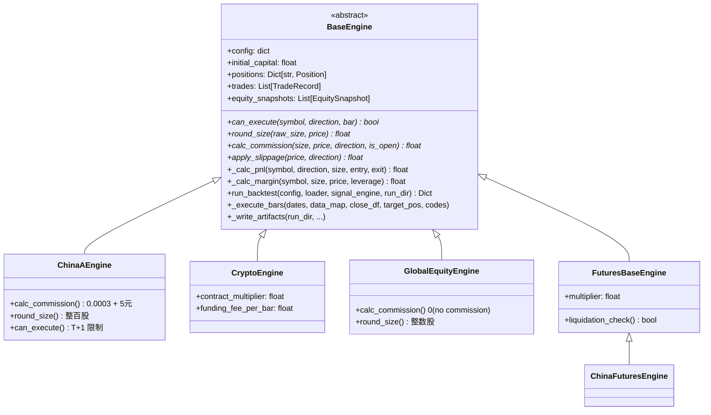
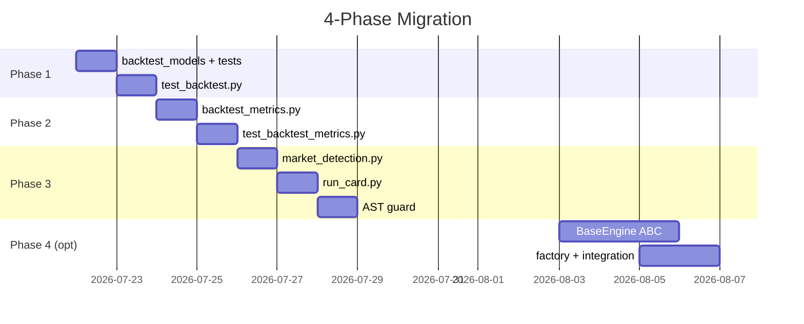

# Backtest 重构全景（Overhaul Plan）

> 借鉴 vibe-trading 成熟 backtest 架构，重构 quantnodes strategy-research 简化版
>
> 状态：草案 · 创建：2026-07-21 · 维护：ll@quantnodes.com

---

## 摘要

本计划将 vibe-trading 的 `backtest/`（2289 行，13 个 engines）与 quantnodes strategy-research 的 `core/backtest.py`（430 行）做对比，按 4 个 Phase 分批重构，按 ROI 与风险递进。

**核心决策**：

| 决策点 | 选项 |
|--------|------|
| **借鉴范围** | 全面重构（D 方案） |
| **依赖策略** | Internal Rebuild（不依赖 vibe-trading pip 包） |
| **借鉴方式** | 源码搬到 `core/utils/`，独立演进，零耦合 |
| **文档存放** | `docs/backtest-overhaul/README.md`（单文件） |
| **实施顺序** | Phase 1 → 2 → 3 → 4，逐 phase 可合并 |

**预计总投入**：10.5 hr（Phase 1+2+3 = 5.5 hr 必修；Phase 4 = 5 hr 可选）。

---

## 目录

1. [背景与动机](#1-背景与动机)
2. [现状对比矩阵](#2-现状对比矩阵)
3. [借鉴 / 不借鉴清单](#3-借鉴--不借鉴清单)
4. [4-Phase 路线图](#4-4-phase-路线图)
5. [Phase 1: Foundation（1.5 hr）](#5-phase-1-foundation15-hr)
6. [Phase 2: Metrics 增强（1.5 hr）](#6-phase-2-metrics-增强15-hr)
7. [Phase 3: Trust Layer（2.5 hr）](#7-phase-3-trust-layer25-hr)
8. [Phase 4: Engine 抽象（5+ hr，OPTIONAL）](#8-phase-4-engine-抽象5-hr-optional)
9. [迁移计划](#9-迁移计划)
10. [测试策略](#10-测试策略)
11. [成功指标](#11-成功指标)
12. [附录：vibe-tracking 原模块参考](#12-附录vibe-tracking-原模块参考)

---

## 1. 背景与动机

### 1.1 现状

| 项目 | 位置 | 规模 | 状态 |
|------|------|------|------|
| **vibe-trading** | `~/vibe_env/lib/python3.11/site-packages/backtest/` | 2289 行 + 13 engines（3131 行） | 成熟产品级 |
| **quantnodes backtest** | `src/strategy_research/core/backtest.py` + `utils/backtest_engine.py` | 430 + 191 = 621 行 | 简化原型 |

两个项目**功能重叠 70%**，架构重叠 30%。quantnodes 没有充分借鉴 vibe-trading 的成熟设计，导致以下问题：

1. **dataclass 缺失** — `core/backtest.py` 用 dict 传递 `Position` / `TradeRecord`，type-unsafe
2. **metrics 不完整** — 缺 `profit_loss_ratio` / `profit_factor` / `information_ratio` 等 9 个键
3. **无可审计性** — 无 `run_card.json/.md` 输出，无法事后追溯
4. **执行无沙箱** — `run_strategy()` 直接 `subprocess.run` 脚本，未做 AST 校验
5. **多市场未分流** — China / Crypto / Forex 都走同一个 engine，规则耦合

### 1.2 决策依据

为什么选择 **Internal Rebuild** 而非 **直接 pip 依赖**：

| 因素 | Internal Rebuild | pip 依赖 vibe-trading |
|------|------------------|----------------------|
| Python 版本兼容 | ✅ 自己的 3.10 / 3.11 都行 | ⚠️ vibe-trading 编译为 3.11 |
| 升级控制 | ✅ 主动同步 | ❌ 跟随上游 |
| 测试隔离 | ✅ pytest 100% 自治 | ⚠️ vibe-trading 的测试不通用 |
| 维护成本 | ⚠️ 升级时手动同步 | ✅ 自动跟新 |
| 当前阶段权重 | ✅ MVP / 极简 | ❌ 长期锁定 |

→ 选择 **Internal Rebuild**，借鉴源码模式，独立演进。

### 1.3 目标 & 非目标

**目标**：
- 全面借鉴 vibe-trading 的设计模式（dataclass/metrics/run_card/AST guard）
- 保持 quantnodes 项目自身 API 稳定，不向上游泄露
- 测试覆盖率追平 100%

**非目标**：
- 不引入 options/futures 等新市场类型（vibe-trading 有 8 个，quantnodes 只需 1-2 个）
- 不引入 MCP server / API server
- 不引入 LOADER_REGISTRY（duckdb 是唯一起点，无需多 loader 注册）

---

## 2. 现状对比矩阵

> 行：14 个功能维度。列：vibe-trading vs quantnodes。

| 维度 | vibe-trading | quantnodes | 评估 |
|------|--------------|------------|------|
| **架构** | BaseEngine ABC + 13 市场引擎 | `utils.backtest_engine.run_backtest`（单文件） | ❌ quantnodes 太简化 |
| **入口** | `python -m backtest.runner <run_dir>` + MCP | `run_strategy` subprocess + YAML | ✅ 各自合理 |
| **信号接口** | `SignalEngine.generate(data_map) -> Dict[str, pd.Series]` | `StrategyEngine.compute_weights()` | ✅ 两种 API 都不够通用 |
| **优化器** | 6 个（mean_variance / risk_parity / ...） | 1 个 risk_node.py | ❌ quantnodes 单一 |
| **数据加载** | LOADER_REGISTRY + 22 个 loader | DuckDB 单一 | ✅ 各自 |
| **校验** | AST 注入 + 路径白名单 | 无 | ❌ 无沙箱 |
| **metrics** | 17 keys（含 IR / excess / profit_factor / ...） | 8 keys | ❌ 不完整 |
| **Artifacts** | ohlcv_*.csv + equity.csv + positions.csv + trades.csv + metrics.csv + validation.json + run_card.{json,md} | run.log + metrics.json + results.tsv | ⚠️ 缺审计 |
| **Trust Layer** | run_card + source hash + warnings hash | metrics.json + git commit | ❌ 不够 |
| **Validation** | 多场景交叉验证 | 无 | ❌ 缺 |
| **Benchmark** | resolve_benchmark + IR | 无 | ❌ 缺 |
| **市场检测** | `_detect_market(code)` 自动分发 | 手动 source 字段 | ⚠️ 缺失 |
| **Dataclass** | frozen dataclass（Position / TradeRecord / EquitySnapshot） | dict + Series | ❌ type-unsafe |
| **bars_per_year** | 7 源 × 6 周期表 | 写死 252 | ⚠️ 不全 |

**结论**：14 维度中，quantnodes 落后 6 项（❌），部分落后 5 项（⚠️），持平 3 项（✅）。

---

## 3. 借鉴 / 不借鉴清单

> 行：vibe-trading 27 个模块。列：决策 = ✅ 借鉴 / ⚠️ 部分借鉴 / ❌ 不借鉴。

| 模块 | 路径（vibe-trading） | 行数 | 决策 | 借鉴至 |
|------|----------------------|------|------|--------|
| `models.py` | `backtest/` | 89 | ✅ | `core/utils/backtest_models.py` |
| `metrics.py` | `backtest/` | 246 | ✅ | `core/utils/backtest_metrics.py` |
| `calc_bars_per_year` | `backtest/metrics.py` | ~30 | ✅ | 合并到 `core/utils/backtest_metrics.py` |
| `by_symbol_stats` | `backtest/metrics.py` | ~25 | ✅ | 同上 |
| `by_exit_reason_stats` | `backtest/metrics.py` | ~25 | ✅ | 同上 |
| `run_card.py` | `backtest/` | 249 | ✅ | `core/run_card.py` |
| `_market_hooks.py` | `backtest/engines/` | 294 | ✅ | `core/utils/market_detection.py` |
| `_validate_signal_engine_source` | `backtest/runner.py` | ~80 | ✅ | 内嵌到 `core/backtest.py` |
| `_validate_signal_engine_class` | `backtest/runner.py` | ~15 | ✅ | 同上 |
| `safe_run_dir` | `src/tools/path_utils.py` | 50 | ⚠️ | 引入核心规则，但不复制 utils |
| `benchmark.py::resolve_benchmark` | `backtest/` | 151 | ⚠️ | Phase 4 评估 |
| `validation.py` | `backtest/` | 418 | ⚠️ | Phase 4 评估 |
| `engines/base.py`（BaseEngine ABC） | `backtest/engines/` | 807 | ⚠️ | 仅借鉴接口契约（abstract methods） |
| `engines/china_a.py` | `backtest/engines/` | 155 | ⚠️ | Phase 4 评估 |
| `engines/crypto.py` | `backtest/engines/` | 77 | ⚠️ | Phase 4 评估 |
| `engines/global_equity.py` | `backtest/engines/` | 81 | ❌ | quantnodes 没 multi-market |
| `engines/forex.py` | `backtest/engines/` | 136 | ❌ | 暂无 forex 需求 |
| `engines/futures_base.py` | `backtest/engines/` | 56 | ❌ | 暂无 futures |
| `engines/options_portfolio.py` | `backtest/engines/` | 634 | ❌ | 暂无 options |
| `engines/india_equity.py` | `backtest/engines/` | 145 | ❌ | 暂无印度市场 |
| `engines/composite.py` | `backtest/engines/` | 187 | ❌ | 暂无 cross-market |
| `engines/_market_hooks.py` 的 `china_futures` 部分 | `backtest/engines/` | ~100 | ❌ | 同上 |
| `engines/china_futures.py` / `global_futures.py` | `backtest/engines/` | 278+251 | ❌ | 同上 |
| `runner.py` 主入口 | `backtest/runner.py` | 950 | ⚠️ | 仅借鉴 CLI + 配置 schema |
| `engines/__init__.py`（executor dispatch） | `backtest/engines/` | 30 | ⚠️ | Phase 4 评估 |
| `optimizers/*` | `backtest/optimizers/` | 6 文件 | ⚠️ | Phase 4 评估 |
| `loaders/*` | `backtest/loaders/` | 22 个 | ❌ | 已有 DuckDB |

**总计**：✅ 完全借鉴 9 个 · ⚠️ 部分借鉴 8 个 · ❌ 不借鉴 10 个。

---

## 4. 4-Phase 路线图



**风险与收益**：

| Phase | 工作量 | 风险 | 收益 | 推荐度 |
|-------|--------|------|------|--------|
| **Phase 1** | 1.5 hr | ⬇️ 极低 | ⬆️ 中 | ✅ 必修 |
| **Phase 2** | 1.5 hr | ⬇️ 低 | ⬆️ 高 | ✅ 必修 |
| **Phase 3** | 2.5 hr | ⬆️ 中 | ⬆️ 高 | ✅ 必修 |
| **Phase 4** | 5+ hr | ⬆️ 高 | ⬆️ 极高 | ⚠️ 可选 |

---

## 5. Phase 1: Foundation（1.5 hr）

> 目标：为 `core/backtest.py` 写测试 + 引入 dataclass 解耦，零回归风险。

### 5.1 tests/test_backtest.py

**覆盖**：12 个函数 + 边界条件，约 25-30 测试。

| 函数 | 测试点 | 数量 |
|------|--------|------|
| `parse_run_log` | 8 个 metric patterns + 缺失文件 + 不匹配行 | 3 |
| `get_next_run_name` | 空目录 / 已有 / 顺序递增 / 异常名 | 4 |
| `create_run_dir` | 幂等 / 嵌套创建 | 2 |
| `save_run_snapshot` | copy strategy.py + config.yaml / 缺失文件 | 2 |
| `save_run_metrics` | JSON 格式 / 中文 unicode | 2 |
| `update_results_tsv` | header / 追加 / 解析回 round-trip | 3 |
| `run_strategy` | missing file / 正常执行 / timeout mock | 3 |
| `run_backtest_from_yaml` | missing yaml / missing config | 2 |
| `evaluate_experiment` | status 更新 / missing dir / DuckDB 调用 | 3 |
| `get_experiment_history` | empty / 多行 / limit / 解析 | 3 |
| `get_best_experiment` | 取 max calmar / 只 keep / metric 异常 | 3 |

**示例**：

```python
def test_parse_run_log_handles_all_metrics(tmp_path):
    log = tmp_path / "run.log"
    log.write_text(
        "calmar: 1.5\n"
        "sharpe: 0.8\n"
        "max_dd: -0.15\n"
        "ann_return: 0.12\n"
        "ann_vol: 0.18\n"
        "sortino: 1.1\n"
        "turnover: 2.5\n"
        "win_rate: 0.55\n"
    )
    metrics = parse_run_log(log)
    assert metrics == {
        "calmar": 1.5, "sharpe": 0.8, "max_dd": -0.15,
        "ann_return": 0.12, "ann_vol": 0.18, "sortino": 1.1,
        "turnover": 2.5, "win_rate": 0.55,
    }


def test_run_strategy_timeout(monkeypatch, tmp_path):
    """mock subprocess.TimeoutExpired → 返回 False with error msg"""
    import subprocess

    def fake_run(*args, **kwargs):
        raise subprocess.TimeoutExpired(cmd=args[0] if args else "", timeout=kwargs.get("timeout", 300))

    monkeypatch.setattr(subprocess, "run", fake_run)
    strategy_dir = tmp_path / "strategy"
    strategy_dir.mkdir()
    (strategy_dir / "strategy.py").write_text("# empty")

    success, output = run_strategy(strategy_dir, timeout=1)
    assert success is False
    assert "超时" in output or "timeout" in output.lower()
```

### 5.2 utils/backtest_models.py

**借鉴**：vibe-trading `backtest/models.py`（89 行，3 个 `@dataclass(frozen=True)`）。

```python
"""Backtest 数据模型 — 借鉴自 vibe-trading backtest/models.py

3 个 immutable dataclass：Position / TradeRecord / EquitySnapshot
"""

from dataclasses import dataclass

import pandas as pd


@dataclass(frozen=True)
class Position:
    """未平仓头寸（多/空）"""

    symbol: str
    direction: int   # 1=多, -1=空
    entry_price: float
    entry_time: pd.Timestamp
    size: float
    leverage: float = 1.0
    entry_bar_idx: int = 0
    entry_commission: float = 0.0


@dataclass(frozen=True)
class TradeRecord:
    """已完成 round-trip 交易记录"""

    symbol: str
    direction: int
    entry_price: float
    exit_price: float
    entry_time: pd.Timestamp
    exit_time: pd.Timestamp
    size: float
    leverage: float
    pnl: float
    pnl_pct: float
    exit_reason: str  # "signal" / "liquidation" / "end_of_backtest"
    holding_bars: int
    commission: float


@dataclass(frozen=True)
class EquitySnapshot:
    """某 bar 的组合状态快照"""

    timestamp: pd.Timestamp
    capital: float    # 自由现金
    unrealized: float  # 总浮动盈亏
    equity: float    # 总权益（含未实现）
    positions: int = 0
```

**测试矩阵**（`tests/test_backtest_models.py`，~15 tests）：

| 测试点 | 验证 |
|--------|------|
| `Position` 构造 + 默认值 | leverage=1.0, entry_commission=0.0 |
| `TradeRecord` 字段命名一致性 | 13 个字段 |
| `EquitySnapshot.positions` 默认值 | 0 |
| `frozen=True` 不可变 | 修改字段抛 `FrozenInstanceError` |
| `__eq__` 与 `__hash__` | 同值对象相等 + 可哈希 |
| repr 包含类名 | `Position(symbol=...)` |
| 序列化 round-trip | dataclasses.asdict 正确 |

### 5.3 验收标准

- [ ] `tests/test_backtest.py` 全部 25-30 测试通过
- [ ] `core/backtest.py` 行覆盖率达到 ≥ 80%
- [ ] `tests/test_backtest_models.py` 全部 15 测试通过
- [ ] 现有 2978 测试 0 个 regression

---

## 6. Phase 2: Metrics 增强（1.5 hr）

> 目标：从 8 keys 扩到 17 keys，引入 bars_per_year 年度化表。

### 6.1 现状 vs 目标

| Key | 现状 | 目标 | 来源 |
|-----|------|------|------|
| `final_value` | ❌ | ✅ 加 | vibe |
| `total_return` | ❌ | ✅ 加 | vibe |
| `annual_return` | ✅（`ann_return`） | ✅ 改名为标准 | vibe |
| `max_drawdown` | ✅ | ✅ | 共用 |
| `sharpe` | ✅ | ✅ | 共用 |
| `calmar` | ✅ | ✅ | 共用 |
| `sortino` | ✅ | ✅ | 共用 |
| `win_rate` | ✅ | ✅ | 共用 |
| `profit_loss_ratio` | ❌ | ✅ 加 | vibe |
| `profit_factor` | ❌ | ✅ 加 | vibe |
| `max_consecutive_loss` | ❌ | ✅ 加 | vibe |
| `avg_holding_days` | ❌ | ✅ 加 | vibe |
| `trade_count` | ❌ | ✅ 加 | vibe |
| `benchmark_return` | ❌ | ✅ 加 | vibe |
| `excess_return` | ❌ | ✅ 加 | vibe |
| `information_ratio` | ✅（`info_ratio`） | ✅ 改名为标准 | vibe |
| `turnover` | ✅ | ✅ | quantnodes 独有 |

### 6.2 utils/backtest_metrics.py（新建，~300 行）

**借鉴自**：`vibe-trading/backtest/metrics.py`（246 行）。

```python
"""Backtest 公共 metrics — 借鉴自 vibe-trading

含 17 keys calc_metrics + bars_per_year 表 + by_symbol/by_exit_reason stats
"""

from __future__ import annotations
from typing import Any, Dict, List, Optional
import numpy as np
import pandas as pd

from .backtest_models import TradeRecord


# ─── Bars/year 表（7 源 × 6 周期）───

_TRADING_DAYS = {
    "tushare": 252, "yfinance": 252, "okx": 365, "akshare": 252,
    "ccxt": 365, "mootdx": 252, "futu": 252,
}
_BARS_PER_DAY = {
    "1m":  {"tushare": 240, "okx": 1440, "yfinance": 390, "akshare": 240, "ccxt": 1440, "mootdx": 240, "futu": 240},
    "5m":  {"tushare": 48,  "okx": 288,  "yfinance": 78,  "akshare": 48,  "ccxt": 288,  "mootdx": 48,  "futu": 48},
    "15m": {"tushare": 16,  "okx": 96,   "yfinance": 26,  "akshare": 16,  "ccxt": 96,   "mootdx": 16,  "futu": 16},
    # ... 30m/1H/4H/1D
}


def calc_bars_per_year(interval: str = "1D", source: str = "tushare") -> int:
    """Bars per year, e.g. 252 (daily A-share) / 8760 (1h crypto) / 525600 (1m crypto)."""
    trading_days = _TRADING_DAYS.get(source, 252)
    bars_per_day = _BARS_PER_DAY.get(interval, {}).get(source, 1)
    return trading_days * bars_per_day


def win_rate_and_stats(trades: List[TradeRecord]) -> Dict[str, float]:
    """Win rate / profit_loss_ratio / profit_factor / max_consec / avg_holding."""
    if not trades:
        return {
            "win_rate": 0.0, "profit_loss_ratio": 0.0,
            "max_consecutive_loss": 0, "avg_holding_bars": 0.0,
            "profit_factor": 0.0,
        }
    wins = [t.pnl for t in trades if t.pnl > 0]
    losses = [t.pnl for t in trades if t.pnl < 0]
    win_rate = len(wins) / len(trades)

    avg_win = float(np.mean(wins)) if wins else 0.0
    avg_loss = abs(float(np.mean(losses))) if losses else 1e-10
    profit_loss_ratio = avg_win / avg_loss if avg_loss > 1e-10 else 0.0

    gross_profit = sum(wins) if wins else 0.0
    gross_loss = abs(sum(losses)) if losses else 1e-10
    profit_factor = gross_profit / gross_loss if gross_loss > 1e-10 else 0.0

    max_consec = 0
    cur_consec = 0
    for t in trades:
        if t.pnl < 0:
            cur_consec += 1
            max_consec = max(max_consec, cur_consec)
        else:
            cur_consec = 0

    hold_bars = [t.holding_bars for t in trades if t.holding_bars > 0]
    avg_holding = float(np.mean(hold_bars)) if hold_bars else 0.0

    return {
        "win_rate": win_rate,
        "profit_loss_ratio": round(profit_loss_ratio, 4),
        "max_consecutive_loss": max_consec,
        "avg_holding_bars": round(avg_holding, 1),
        "profit_factor": round(profit_factor, 4),
    }


def by_symbol_stats(trades: List[TradeRecord]) -> Dict[str, Dict[str, Any]]:
    """{symbol: {count, win_rate, total_pnl, avg_pnl}}."""

def by_exit_reason_stats(trades: List[TradeRecord]) -> Dict[str, Dict[str, Any]]:
    """{reason: {count, total_pnl}}."""


def calc_metrics(
    equity_curve: pd.Series,
    trades: List[TradeRecord],
    initial_cash: float,
    bars_per_year: Optional[int] = 252,
    bench_ret: Optional[pd.Series] = None,
) -> Dict[str, Any]:
    """17-key 完整 metrics，cross-market 用 bars_per_year=None 自动按日历日年化。"""
    if len(equity_curve) == 0:
        return _empty_metrics(initial_cash)

    n = len(equity_curve)

    # Calendar-day annualization for cross-market
    if bars_per_year is None:
        first, last = equity_curve.index[0], equity_curve.index[-1]
        calendar_days = (last - first).days
        years = calendar_days / 365.25 if calendar_days > 0 else 1.0
        bpy = int(n / years) if years > 0 else 252
    else:
        bpy = bars_per_year

    port_ret = equity_curve.pct_change().fillna(0.0)

    total_ret = float(equity_curve.iloc[-1] / initial_cash - 1)
    ann_ret = float((1 + total_ret) ** (bpy / max(n, 1)) - 1)
    vol = float(port_ret.std())
    sharpe = float(port_ret.mean() / (vol + 1e-10) * np.sqrt(bpy))

    peak = equity_curve.cummax()
    dd = (equity_curve - peak) / peak.replace(0, 1)
    max_dd = float(dd.min())

    calmar = ann_ret / abs(max_dd) if abs(max_dd) > 1e-10 else 0.0

    downside = port_ret[port_ret < 0]
    downside_std = float(downside.std()) if len(downside) > 1 else 1e-10
    sortino = float(port_ret.mean() / (downside_std + 1e-10) * np.sqrt(bpy))

    trade_stats = win_rate_and_stats(trades)

    # Benchmark comparison
    bench_return = 0.0
    excess = 0.0
    ir = 0.0
    if bench_ret is not None and len(bench_ret) > 0:
        bench_return = float((1 + bench_ret).prod() - 1)
        excess = total_ret - bench_return
        active_ret = port_ret - bench_ret.reindex(port_ret.index).fillna(0.0)
        active_std = float(active_ret.std())
        ir = float(active_ret.mean() / (active_std + 1e-10) * np.sqrt(bpy))

    return {
        "final_value": float(equity_curve.iloc[-1]),
        "total_return": total_ret,
        "annual_return": ann_ret,
        "max_drawdown": max_dd,
        "sharpe": sharpe,
        "calmar": round(calmar, 4),
        "sortino": round(sortino, 4),
        "win_rate": trade_stats["win_rate"],
        "profit_loss_ratio": trade_stats["profit_loss_ratio"],
        "profit_factor": trade_stats["profit_factor"],
        "max_consecutive_loss": trade_stats["max_consecutive_loss"],
        "avg_holding_days": trade_stats["avg_holding_bars"],
        "trade_count": len(trades),
        "benchmark_return": round(bench_return, 6),
        "excess_return": round(excess, 6),
        "information_ratio": round(ir, 4),
    }


def _empty_metrics(initial_cash: float) -> Dict[str, Any]:
    """空 equity 返回零值 dict。"""
    return {
        "final_value": initial_cash,
        "total_return": 0, "annual_return": 0, "max_drawdown": 0,
        "sharpe": 0, "calmar": 0, "sortino": 0,
        "win_rate": 0, "profit_loss_ratio": 0, "profit_factor": 0,
        "max_consecutive_loss": 0, "avg_holding_days": 0, "trade_count": 0,
        "benchmark_return": 0, "excess_return": 0, "information_ratio": 0,
    }
```

### 6.3 改造点

| 改造 | 位置 |
|------|------|
| `core/backtest.py::parse_run_log` 保持原样（8 keys），但调用 `backtest_metrics.calc_metrics()` 用一组新 keys（17 keys）替代 `run.log` 解析 | 后向兼容 |
| `core/utils/metrics.py::extended_metrics` 改用 `calc_metrics` 实现 | 内部重构 |
| `strategy.py` 用户脚本输出 `print(calc_metrics(...))` 也能解析 | 兼容 |

### 6.4 测试

`tests/test_backtest_metrics.py`（~35 tests）：

| 测试组 | 数量 |
|--------|------|
| `calc_bars_per_year`：tushare / okx / yfinance / akshare 全源 × 全周期 | ~25 |
| `win_rate_and_stats`：空 trades / 全赢 / 全亏 / 混合 | 4 |
| `by_symbol_stats` / `by_exit_reason_stats` | 2 |
| `calc_metrics`：完美上行 / 单调下行 / 横盘 / 含 benchmark / 空曲线 | 5 |

### 6.5 验收标准

- [ ] 17 keys 全部测试通过
- [ ] bars_per_year 表对每源每周期返回正确整数
- [ ] annualization 数学正确：已知输入 → 已知输出（用 fixture 验证）

---

## 7. Phase 3: Trust Layer（2.5 hr）

> 目标：可审计性 + 安全性。市场检测 + run_card + AST 注入防护。

### 7.1 utils/market_detection.py（新建，~150 行）

**借鉴自**：`vibe-trading/backtest/engines/_market_hooks.py`（294 行）。

```mermaid
flowchart TD
    Start[code: str] --> A{是否 \\d{6}\\.(SZ|SH)?}
    A -- 是 --> AS[a_share<br/>tushare]
    A -- 否 --> B{是否 \\d{4,5}\\.HK?}
    B -- 是 --> HK[hk_equity<br/>yfinance]
    B -- 否 --> C{是否 ^[A-Z]+-USDT$?}
    C -- 是 --> CR[crypto<br/>okx]
    C -- 否 --> D{是否 期货正则?}
    D -- 是 --> FT[futures<br/>tushare]
    D -- 否 --> E{是否 forex?}
    E -- 是 --> FX[forex<br/>akshare]
    E -- 否 --> F{是否 ^[A-Z]{1,6}\\.(NS|BO)$?}
    F -- 是 --> IND[india_equity<br/>yahoo]
    F -- 否 --> G{是否 ^[A-Z]+/USDT$?}
    G -- 是 --> CR
    G -- 否 --> Def[fallback<br/>tushare]

    style AS fill:#90EE90
    style CR fill:#FFB6C1
    style FT fill:#FFD700
```

**实现**：

```python
"""市场检测 — 借鉴自 vibe-trading backtest/engines/_market_hooks.py

按代码格式正则分到 8 种市场，每种映射回 legacy data source 名。
"""

import re
from typing import Optional

_MARKET_PATTERNS = {
    "a_share": re.compile(r"^\d{6}\.(SZ|SH)$"),
    "us_equity": re.compile(r"^[A-Z]{1,5}$"),
    "hk_equity": re.compile(r"^\d{4,5}\.HK$"),
    "crypto": re.compile(r"^[A-Z]+-USDT$|^[A-Z]+/USDT$"),
    "futures": re.compile(r"^[A-Z]+\d{4}\.(SHFE|DCE|ZCE|CZCE|GFEX)$"),
    "forex": re.compile(r"^[A-Z]{3}/[A-Z]{3}$|^[A-Z]{6}\.FX$"),
    "india_equity": re.compile(r"^[A-Z]{1,6}\.(NS|BO)$"),
    "fund": re.compile(r"^\d{6}\.(OF|SZ_OF|SH_OF)$"),
}

_MARKET_TO_SOURCE = {
    "a_share": "tushare",
    "us_equity": "yfinance",
    "hk_equity": "yfinance",
    "crypto": "okx",
    "futures": "tushare",
    "fund": "tushare",
    "macro": "akshare",
    "forex": "akshare",
}


def detect_market(code: str) -> str:
    """根据 code 返回 market 类型，未匹配返回 'unknown'。"""
    for market, pattern in _MARKET_PATTERNS.items():
        if pattern.match(code):
            return market
    return "unknown"


def detect_source(code: str) -> str:
    """market → legacy source name (tushare/yfinance/okx/akshare)。"""
    market = detect_market(code)
    return _MARKET_TO_SOURCE.get(market, "tushare")


def detect_submarket(codes: list[str]) -> str:
    """US/HK 细分。"""
    if any(detect_market(c) == "us_equity" for c in codes):
        return "us"
    if any(detect_market(c) == "hk_equity" for c in codes):
        return "hk"
    return "us"  # 默认
```

**测试**（`tests/test_market_detection.py`，~30 tests）：

| 测试 | 验证 |
|------|------|
| `000001.SZ` / `600000.SH` | a_share |
| `AAPL` / `TSLA` | us_equity |
| `00700.HK` / `09988.HK` | hk_equity |
| `BTC-USDT` / `ETH/USDT` | crypto |
| `CU2501.SHFE` / `M2501.DCE` | futures |
| `EUR/USD` / `EURUSD.FX` | forex |
| `RELIANCE.NS` / `TCS.BO` | india_equity |
| `510300.OF` | fund |
| `RANDOM_GARBAGE` | unknown |
| `detect_source` 全部 8 市场 | 正确映射 |
| `detect_submarket` 混合 list | US 优先 |

### 7.2 core/run_card.py（新建，~200 行）

**借鉴自**：`vibe-trading/backtest/run_card.py`（249 行）。

```python
"""Trust layer run card 生成器 — 借鉴自 vibe-trading

输出 run_card.json (机器读) + run_card.md (人读) 到 run_dir。
含 config hash + data_sources + warnings + strategy source hash。
"""

from __future__ import annotations

import hashlib
import json
from datetime import datetime, timezone
from pathlib import Path
from typing import Any, Dict, Mapping, Optional, Sequence


SCHEMA_VERSION = "0.1"
BACKTEST_SUMMARY_KEYS = (
    "codes", "start_date", "end_date", "interval",
    "engine", "initial_cash", "source",
)


def _config_summary(config: Mapping[str, Any]) -> Dict[str, Any]:
    """仅保留 summary 字段，避免泄漏 secrets。"""
    return {k: config.get(k) for k in BACKTEST_SUMMARY_KEYS if k in config}


def _hash_dict(obj: Mapping[str, Any]) -> str:
    """SHA-256 of sorted JSON for reproducibility."""
    raw = json.dumps(obj, sort_keys=True, ensure_ascii=False, default=str)
    return hashlib.sha256(raw.encode("utf-8")).hexdigest()


def _hash_file(path: Optional[Path]) -> str:
    """SHA-256 of file content (for strategy source)."""
    if path is None or not Path(path).exists():
        return ""
    return hashlib.sha256(Path(path).read_bytes()).hexdigest()


def write_run_card(
    run_dir: Path,
    config: Mapping[str, Any],
    metrics: Mapping[str, Any],
    *,
    data_sources: Optional[Sequence[str]] = None,
    strategy_path: Optional[Path] = None,
    warnings: Optional[Sequence[str]] = None,
    artifact_refs: Optional[Sequence[Mapping[str, Any]]] = None,
) -> Dict[str, Any]:
    """写 run_card.{json,md} 到 run_dir。"""
    run_dir = Path(run_dir)

    summary = _config_summary(config)
    run_card = {
        "schema_version": SCHEMA_VERSION,
        "generated_at": datetime.now(timezone.utc).isoformat(),
        "config": summary,
        "config_hash": _hash_dict(summary),
        "metrics": {k: v for k, v in metrics.items() if not isinstance(v, dict)},
        "data_sources": list(data_sources or []),
        "strategy_hash": _hash_file(strategy_path),
        "warnings": list(warnings or []),
        "artifact_refs": list(artifact_refs or []),
    }

    # JSON
    json_path = run_dir / "run_card.json"
    json_path.write_text(
        json.dumps(run_card, indent=2, ensure_ascii=False),
        encoding="utf-8",
    )

    # Markdown（人类可读）
    md_path = run_dir / "run_card.md"
    md_lines = [
        f"# Run Card `{run_dir.name}`",
        "",
        f"- Schema: `{SCHEMA_VERSION}`",
        f"- Generated: {run_card['generated_at']}",
        f"- Config hash: `{run_card['config_hash'][:16]}...`",
        f"- Strategy hash: `{run_card['strategy_hash'][:16]}...`" if run_card['strategy_hash'] else "- Strategy hash: (none)",
        "",
        "## Config",
        "",
        "| Key | Value |",
        "|-----|-------|",
    ]
    for k, v in summary.items():
        md_lines.append(f"| `{k}` | `{v}` |")
    md_lines += [
        "",
        "## Metrics",
        "",
        "| Metric | Value |",
        "|--------|-------|",
    ]
    for k, v in run_card["metrics"].items():
        if isinstance(v, float):
            md_lines.append(f"| `{k}` | {v:.4f} |")
        else:
            md_lines.append(f"| `{k}` | `{v}` |")
    if warnings:
        md_lines += ["", "## Warnings", ""]
        for w in warnings:
            md_lines.append(f"- {w}")
    md_path.write_text("\n".join(md_lines) + "\n", encoding="utf-8")

    return run_card
```

### 7.3 AST 注入防护（嵌入 `core/backtest.py`）

**借鉴自**：`vibe-trading/backtest/runner.py::_validate_signal_engine_source`（~80 行）。

```python
# core/backtest.py 新增
import ast


def _is_literal_node(node: ast.AST) -> bool:
    """AST 节点是否纯 literal（无副作用）。"""
    if isinstance(node, ast.Constant):
        return True
    if isinstance(node, (ast.Tuple, ast.List, ast.Set)):
        return all(_is_literal_node(item) for item in node.elts)
    if isinstance(node, ast.Dict):
        return all(
            (_is_literal_node(k) if k else True) and _is_literal_node(v)
            for k, v in zip(node.keys, node.values)
        )
    return False


def _is_safe_constant_assignment(node: ast.AST) -> bool:
    """顶层赋值是否为 literal-only。"""
    if isinstance(node, ast.Assign):
        return _is_literal_node(node.value)
    if isinstance(node, ast.AnnAssign):
        return node.value is None or _is_literal_node(node.value)
    return False


def _is_safe_reference(node: Optional[ast.AST]) -> bool:
    """Annotation/base 表达式是否安全（不能调用）。"""
    if node is None:
        return True
    if isinstance(node, (ast.Name, ast.Attribute, ast.Constant)):
        return True
    if isinstance(node, ast.Subscript):
        return _is_safe_reference(node.value) and _is_safe_reference(node.slice)
    if isinstance(node, ast.Tuple):
        return all(_is_safe_reference(item) for item in node.elts)
    if isinstance(node, ast.BinOp) and isinstance(node.op, ast.BitOr):
        return _is_safe_reference(node.left) and _is_safe_reference(node.right)
    return False


def _validate_signal_engine_source(file_path: Path) -> None:
    """AST 拒绝 decorators/unsafe imports/circular self-import/可执行 top-level。

    Raises:
        ValueError: 含不安全代码
    """
    try:
        tree = ast.parse(file_path.read_text(encoding="utf-8"), filename=str(file_path))
    except SyntaxError as exc:
        raise ValueError(f"Invalid signal_engine.py syntax: {exc}") from exc

    for node in tree.body:
        if isinstance(node, ast.Expr) and isinstance(node.value, ast.Constant):
            continue
        if isinstance(node, ast.ImportFrom) and node.module == "signal_engine":
            raise ValueError("Circular import: 'from signal_engine import ...' is forbidden")
        if isinstance(node, (ast.Import, ast.ImportFrom)):
            continue
        if isinstance(node, (ast.FunctionDef, ast.AsyncFunctionDef)):
            # 检查 default 都是 literal
            for default in node.args.defaults:
                if not _is_literal_node(default):
                    raise ValueError(f"Non-literal default in {node.name!r}")
            # 检查 annotations 都是 safe reference
            for annotation in [node.returns, *(a.annotation for a in node.args.args if a.annotation)]:
                if not _is_safe_reference(annotation):
                    raise ValueError(f"Unsafe annotation in {node.name!r}")
            continue
        if isinstance(node, ast.ClassDef):
            if node.decorator_list:
                raise ValueError(f"Decorators on class {node.name!r} are forbidden")
            continue
        if _is_safe_constant_assignment(node):
            continue
        raise ValueError(
            f"Executable top-level statement {type(node).__name__} is not allowed"
        )


def run_strategy(strategy_dir: Path, timeout: int = 300) -> tuple[bool, str]:
    """运行策略脚本（增加 AST 校验）。"""
    strategy_file = strategy_dir / "strategy.py"
    if not strategy_file.exists():
        return False, f"策略文件不存在: {strategy_file}"

    # 新增: AST 校验
    try:
        _validate_signal_engine_source(strategy_file)
    except ValueError as exc:
        return False, f"策略脚本安全校验失败: {exc}"

    try:
        import sys
        result = subprocess.run(...)
        ...
```

**测试**（`tests/test_backtest_ast_guard.py`，~12 tests）：

| 测试 | 验证 |
|------|------|
| 合法纯函数 | 通过 |
| 带 decorators | 拒绝 |
| circular self-import | 拒绝 |
| unsafe annotation (`os.system`) | 拒绝 |
| non-literal default `func(x=lambda: print(1))` | 拒绝 |
| executable top-level `os.system("rm -rf /")` | 拒绝 |
| 空文件 / 注释 / docstring | 通过 |
| 嵌套 ClassDef | 通过 |

### 7.4 验收标准

- [ ] 30 个 market detection 测试通过
- [ ] 8 个 run_card 测试通过（含 JSON/MD 生成、SHA-256 验证）
- [ ] 12 个 AST guard 测试通过
- [ ] `run_strategy()` 集成 AST guard，恶意 .py 被拒

---

## 8. Phase 4: Engine 抽象（5+ hr，OPTIONAL）

> 目标：China A / Crypto / Forex 各有独立 engine 规则。**视需求决定**。

### 8.1 BaseEngine ABC（~250 行）



### 8.2 engine_factory.py

```python
def create_market_engine(source: str, config: dict, codes: list[str]) -> BaseEngine:
    """根据 source/codes 选合适的 engine。"""
    markets = {detect_market(c) for c in codes}

    if "crypto" in markets:
        return CryptoEngine(config)
    if "futures" in markets:
        return ChinaFuturesEngine(config) if any(is_china_futures(c) for c in codes) else GlobalFuturesEngine(config)
    if "forex" in markets:
        return ForexEngine(config)
    if "india_equity" in markets:
        return IndiaEquityEngine(config)
    if "us_equity" in markets or "hk_equity" in markets:
        return GlobalEquityEngine(config, market=detect_submarket(codes))
    return ChinaAEngine(config)  # 默认 A 股
```

### 8.3 5+ hr 工作量分布

| 任务 | 行数估算 | 时间 |
|------|---------|------|
| BaseEngine ABC + `_execute_bars` + `_rebalance` | 250 | 1.0 hr |
| ChinaAEngine + CryptoEngine 2 实现 | 300 | 1.5 hr |
| engine_factory + 集成到 `run_backtest_from_yaml` | 150 | 0.5 hr |
| 全部 engine 测试 | ~40 测试 | 1.5 hr |
| 文档 + 迁移 guide | 100 | 0.5 hr |

### 8.4 Phase 4 是否值得？

**赞同**：长期来看（多市场、加密、永续），必须重构。

**反对**：当前 quantnodes 只服务 A 股研究，Phase 4 投入与收益短期不匹配。

**建议**：Phase 1-3 完成后再评估。如果 3 个月内出现 crypto / futures 需求，启动 Phase 4。

---

## 9. 迁移计划

### 9.1 向后兼容策略

| API | 兼容策略 | deprecation 时间表 |
|-----|---------|-------------------|
| `core/backtest.py::parse_run_log` 返回 8 keys | 不变 | 永远保留 |
| `core/backtest.py::run_strategy` 接口 | 不变（仅内部加 AST guard） | 永远保留 |
| `core/utils/metrics.py::extended_metrics` | 新增 17 keys 不破坏 8 keys | 永远保留 |
| `core/utils/strategy_engine.py::StrategyEngine` | 接口不变 | Phase 4 评估 |
| `core/utils/backtest_engine.py::run_backtest` | 接口不变 | Phase 4 评估（可能标 deprecated） |

### 9.2 引入顺序



### 9.3 Rollback 策略

- 每个 phase = 1 PR，独立 revert
- Phase 1 → 2 互不依赖，可任意回退
- Phase 3 AST guard 是 opt-out：`run_strategy(..., skip_ast_check=True)` 应急
- Phase 4 完全独立，不影响 Phase 1-3

---

## 10. 测试策略

### 10.1 现状

- `tests/` 现有 2978 测试
- `core/backtest.py` 行覆盖 0%
- `core/utils/backtest_engine.py` 行覆盖 0%
- `core/utils/strategy_engine.py` 行覆盖 0%

### 10.2 新增测试预期

| Phase | 新增文件 | 新增测试 |
|-------|---------|---------|
| 1 | `tests/test_backtest.py` | 25-30 |
| 1 | `tests/test_backtest_models.py` | 15 |
| 2 | `tests/test_backtest_metrics.py` | 35 |
| 3 | `tests/test_market_detection.py` | 30 |
| 3 | `tests/test_run_card.py` | 8 |
| 3 | `tests/test_backtest_ast_guard.py` | 12 |
| 4 | `tests/test_engines/`（多文件） | 40 |
| **总计** | **8-9 文件** | **~165-170 测试** |

### 10.3 覆盖率目标

| 模块 | 当前 | Phase 后 |
|------|------|----------|
| `core/backtest.py` | 0% | 80%+ (Phase 1) |
| `core/utils/backtest_models.py` | — | 100% |
| `core/utils/backtest_metrics.py` | — | 100% |
| `core/utils/market_detection.py` | — | 100% |
| `core/run_card.py` | — | 95%+ |
| `core/utils/backtest_engine.py` | 0% | 50%+ (Phase 4) |

---

## 11. 成功指标

| KPI | 目标 | 度量 |
|-----|------|------|
| **代码量** | `core/backtest.py` 从 430 → 100（仅 orchestration），其它职责外移 | 行数对比 |
| **测试** | 2978 → 3143 (+165) | pytest 报告 |
| **覆盖率** | `core/backtest.py` 0% → 80%+ | `pytest --cov` |
| **metrics** | 8 keys → 17 keys | `calc_metrics` 字典键数 |
| **可审计性** | 新增 `run_card.json/.md` | 文件存在 |
| **安全性** | AST guard 拒绝 12 种恶意构造 | 测试覆盖率 |
| **后向兼容** | 0 个用户 API breaking | 现有 CLI 仍工作 |
| **CI 时间** | < 25 sec | pytest 报告 |

---

## 12. 附录：vibe-tracking 原模块参考

| 本计划借用模块 | vibe-trading 路径 | 行数 |
|--------------|-------------------|------|
| `models.py`（dataclass） | `~/vibe_env/lib/python3.11/site-packages/backtest/models.py` | 89 |
| `metrics.py::calc_metrics` | `~/vibe_env/lib/python3.11/site-packages/backtest/metrics.py` | 246 |
| `metrics.py::calc_bars_per_year` | 同上 `_TRADING_DAYS` 表 | ~30 |
| `run_card.py` | `~/vibe_env/lib/python3.11/site-packages/backtest/run_card.py` | 249 |
| `_market_hooks.py` | `~/vibe_env/lib/python3.11/site-packages/backtest/engines/_market_hooks.py` | 294 |
| `_validate_signal_engine_source` | `~/vibe_env/lib/python3.11/site-packages/backtest/runner.py:200-280` | ~80 |
| `_validate_signal_engine_class` | `~/vibe_env/lib/python3.11/site-packages/backtest/runner.py:280-300` | ~20 |
| `BaseEngine` ABC | `~/vibe_env/lib/python3.11/site-packages/backtest/engines/base.py:1-360` | 360 |
| `_execute_bars` | 同上 500-620 | ~120 |
| `_rebalance` | 同上 580-650 | ~70 |

### 借鉴原则

> 借鉴**接口契约**（函数签名、返回类型、字段含义），借鉴**核心算法**（calmar/IR/profit_factor 数学公式），借鉴**不可变 dataclass 设计**，**不**盲目搬运 context-manager、logging setup、JSON 输出 envelope 等高耦合部分。

### 不借鉴的子模块

| 模块 | 行数 | 不借鉴理由 |
|------|------|----------|
| `engines/options_portfolio.py` | 634 | 暂无 options 需求 |
| `engines/futures_base.py` | 56 | 暂无 futures |
| `engines/china_futures.py` | 278 | 同上 |
| `engines/global_futures.py` | 251 | 同上 |
| `engines/forex.py` | 136 | 暂无 forex |
| `engines/india_equity.py` | 145 | 暂无印度市场 |
| `engines/composite.py` | 187 | 暂无 cross-market |
| `engines/_market_hooks.py:china_futures` | 部分 | 同上 |
| `engines/__init__.py`（executor dispatch） | 30 | 当前单 engine，无需 dispatch |
| `loaders/*` | 22 files | 已有 DuckDB，不需要多 loader |
| `runner.py` 主入口 | 950 | 已有 `run_strategy` + `run_backtest_from_yaml` |
| `cli/`、`mcp_server/`、`api_server/` | — | 范围外 |
| `optimizers/*` | 6 文件 | Phase 4 评估 |
| `benchmarks/`、`validation/`、`correlation.py` | — | Phase 4 评估 |

---

## 备注 & 决策日志

### 2026-07-21 创建
- 由 ll（minimax-cn-coding-plan/MiniMax-M3）创建
- 基于 vibe-trading 0.1.11 包的代码调研
- 基于 quantnodes strategy-research 当前 2978 测试通过状态

### 决策矩阵
- 是否引入 dataloader registry：**否**（已有 DuckDB 体系）
- 是否引入 options/futures engines：**否**（当前无需求）
- 是否引入 MCP server：**否**（不在本计划范围）
- 是否引入 run card：**是**（可审计性提升显著）
- 是否引入 AST guard：**是**（安全性提升显著）

### 反馈通道
- 项目主分支：`main`
- 远程：`sn0wfree/quantnodes-strategy-research`
- 文档位置：`docs/backtest-overhaul/README.md`（单文件）

---

> **审阅提示**：本文档完成后进入讨论环节。所有 4 个 Phase 必须在审阅批准后才开始实施。每个 Phase 完成一个独立 PR，便于回滚。
